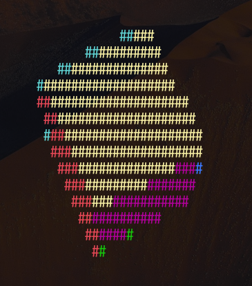

# 3D 回転キューブ レンダラー

C 言語で実装されたコンソールベースの 3D 回転キューブレンダラーです。リアルタイムで回転するカラフルな 3D キューブをターミナル/コンソール上に描画します。

## 🎯 特徴

- **リアルタイム 3D レンダリング**: 60FPS で滑らかなアニメーション
- **カラー表示**: 各面が異なる色で表示（赤・緑・黄・青・マゼンタ・シアン）
- **対話的操作**: キーボードでキューブの位置やサイズを制御
- **クロスプラットフォーム**: Windows・Linux・Unix で動作
- **Z バッファリング**: 正確な奥行き判定による 3D 表現
- **透視投影**: リアルな遠近法効果

## 📋 動作環境

- C99 対応のコンパイラ（gcc、clang、MSVC など）
- Windows 10+（ANSI エスケープシーケンス対応）
- Linux/Unix（POSIX 互換環境）

## 🚀 ビルドと実行

### Linux/Unix

```bash
# コンパイル
gcc -o cube cube.c -lm

# 実行
./cube
```

### Windows

```bash
# コンパイル（gcc/MinGW）
gcc -o cube.exe cube.c -lm

# 実行
cube.exe
```

または Visual Studio の場合：

```cmd
# コンパイル
cl cube.c

# 実行
cube.exe
```

## 🎮 操作方法

| キー      | 操作     |
| --------- | -------- |
| `q`       | 終了     |
| `h`       | 左に移動 |
| `l`       | 右に移動 |
| `k`       | 上に移動 |
| `j`       | 下に移動 |
| `+` / `=` | 拡大     |
| `-` / `_` | 縮小     |

## 🔧 技術仕様

### 3D グラフィックス技術

- **回転行列**: XYZ 軸の 3 次元回転を行列計算で実装
- **透視投影**: `1/z` を用いた遠近法
- **Z バッファ**: 深度情報による正確な面の表示制御
- **ダブルバッファリング**: フリッカーのない描画

### デフォルト設定

- 画面サイズ: 160×44 文字
- キューブサイズ: 20.0 単位（可変）
- フレームレート: 約 60FPS
- カメラ距離: 100.0 単位

### プラットフォーム対応

- **Windows**: Windows API を使用して ANSI エスケープシーケンスを有効化
- **Unix/Linux**: termios と fcntl による非ブロッキング入力を実装

## 🏗️ コード構造

### 主要な構造体

- `CubeRenderer`: レンダリングシステム全体を管理
- `Point3D`: 3D 座標点を表現

### 核心関数

- `calculatePoint()`: 3D 回転変換
- `projectAndDraw()`: 3D→2D 投影と描画
- `drawCube()`: 6 つの面を個別に描画
- `render()`: 最終的な画面出力
- `handleInput()`: キーボード入力処理

## 🎨 表示例

実行すると以下のようなカラフルな 3D キューブがリアルタイムで回転します：



🎨 **実際の表示 features:**

- 赤・緑・黄・青・マゼンタ・シアンの各面が色分け
- 60FPS で滑らかに回転
- キーボード操作でインタラクティブに制御可能
- Z バッファリングによる正確な 3D 表現

💡 **ヒント**: 実際にはターミナルの ANSI カラー機能により、各面が異なる色で表示され、リアルな 3D キューブとして回転します。

## 📝 実装のポイント

1. **数学的な正確性**: 三角関数を用いた正確な 3D 変換
2. **効率的なメモリ管理**: 動的メモリ確保と適切な解放
3. **プラットフォーム抽象化**: プリプロセッサによる環境差の吸収
4. **最適化**: インライン関数や効率的なバッファ操作

## 🐛 トラブルシューティング

### Windows で色が表示されない場合

Windows 10 以降が必要です。または以下のレジストリ設定を確認してください：

```
HKEY_CURRENT_USER\Console\VirtualTerminalLevel = 1
```

### Linux で動作が遅い場合

ターミナルの描画能力によってはパフォーマンスが低下することがあります。`xterm`や`gnome-terminal`などのモダンなターミナルの使用を推奨します。

## 📄 ライセンス

このコードは学習目的で自由に使用、改変、再配布できます。

## 🤝 貢献

バグ報告や改善提案は歓迎します。Issue や Pull Request でご連絡ください。

